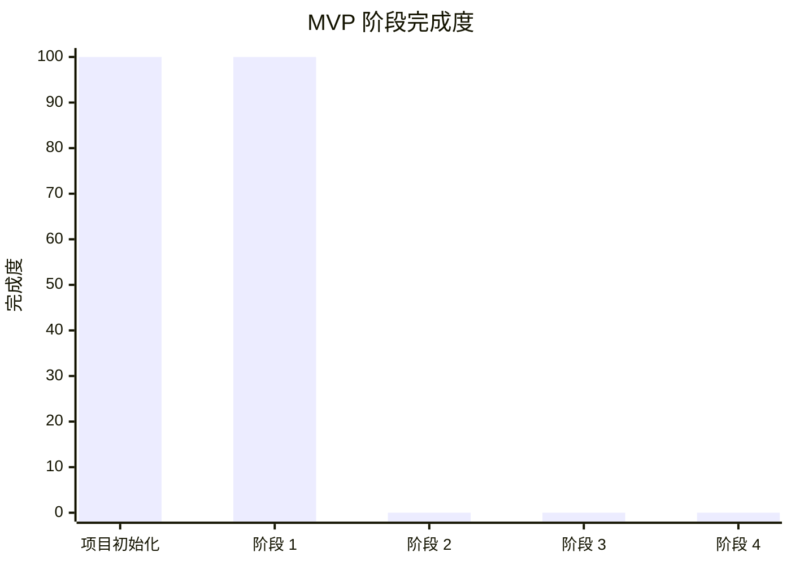
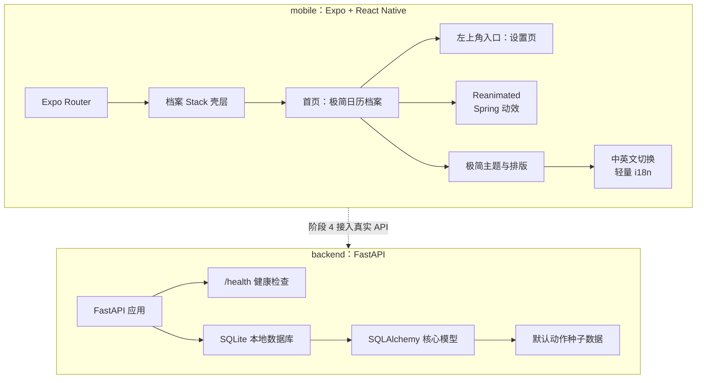
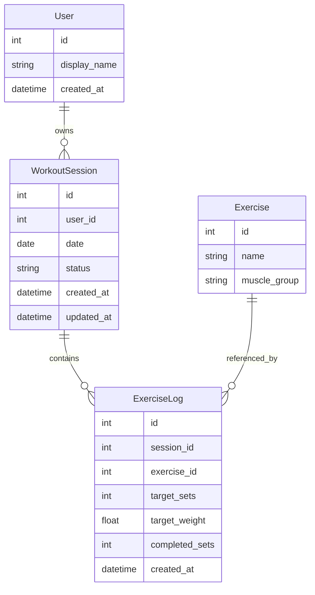
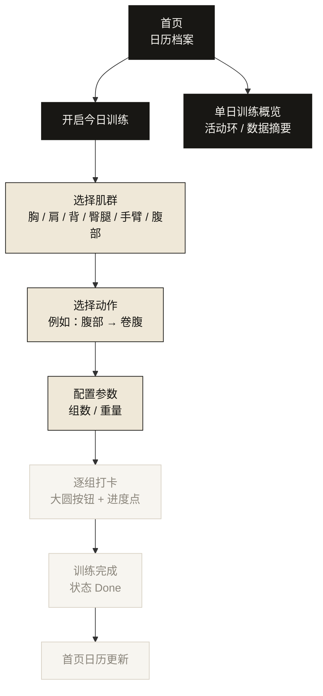
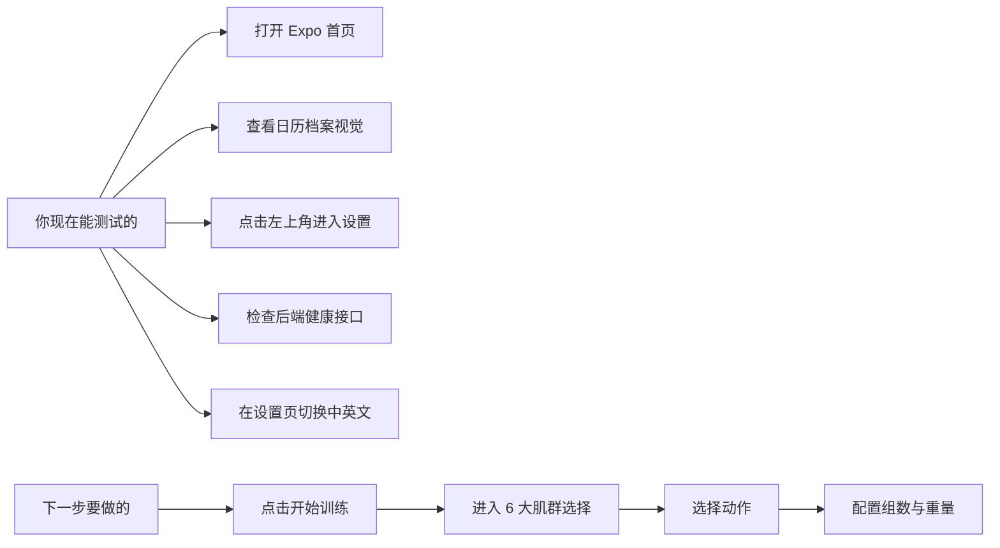

# MVP 进度地图

本文档用图形方式展示当前项目进度。建议在支持 Mermaid 的 Markdown 预览器中查看，例如 GitHub、VS Code Markdown Preview 或部分文档工具。

## 当前总览

## 阶段完成度

## 当前架构

## 数据模型地图

## 产品流程地图

## 功能清单

| 模块 | 状态 | 说明 |
| --- | --- | --- |
| 项目目录隔离 | 已完成 | 新项目位于 `fitness-minimal/` |
| Expo 前端骨架 | 已完成 | 已配置 Expo Router |
| Reanimated 动效 | 已完成 | 首页、弹窗与训练流程已有 spring 动效，SDK 54 下使用 Reanimated 4 |
| 中英文切换 | 已完成 | 设置页可切换中文 / English，并从首页左上角进入 |
| 极简日历首页 | 已完成 | 单月、单色、无空心占位的极简日历 |
| 黑色运动环视觉 | 已完成 | 首页改为黑色背景与每日训练环 |
| 日历主色圆环 | 已完成 | 默认统一主色圆环，透明度表达训练量 |
| 首页日历详情 | 已完成 | 点击日期弹出当天训练记录窗口 |
| UI 主题自定义 | 已完成 | 深色 / 浅色在一级设置，主色与肌群色收纳进“个性化设置” |
| 渐进式肌群信息 | 已完成 | 点击肌群后平滑切换分段颜色、文字和图例 |
| 单日训练概览页 | 已完成 | 点击日历日期进入活动环概览，当前为 mock 数据 |
| 设置入口 | 已完成 | 底部导航已移除，设置收纳到首页左上角菜单 |
| FastAPI 后端骨架 | 已完成 | 已有应用入口和健康检查 |
| 数据库模型 | 已完成 | 已有 4 张核心表 |
| 默认动作种子 | 已完成 | 已覆盖 6 大肌群 |
| 肌群选择页 | 已完成 | 点击“开启今日训练”进入 6 大肌群选择 |
| 动作选择页 | 已完成 | 选择肌群后进入本地动作列表，支持多选动作 |
| 参数配置页 | 已完成 | 单动作直接进入配置，多动作从今日动作列表进入，组数 / 重量使用纵向滚轮 |
| 逐组打卡页 | 已完成 | 中央大圆按钮逐组打卡，单动作回首页，多动作回列表 |
| 本地训练记录 | 已完成 | 完成动作后写入本地 session，首页日历详情同步更新 |
| 档案记录弹窗 | 已完成 | 点击某天日历以独立窗口查看动作、组数、重量和训练量 |
| 前后端真实联动 | 未开始 | 阶段 4 开发 |

## 现在我们在哪

